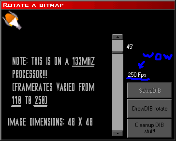



## AMAZINGLY FAST IMAGE ROTATION \*REALTIME\*

### Description

I wrote this to be a part of my game engine. It's purpose is to rotate a bitmap, for example, a sprite in a game, to any angle (fixed point only) in realtime, that is, fast enough that it can be done on a frame-by-frame basis in the game. For example, if you had a birds-eye-view scroller, and you had a spaceship in the middle of the screen and you wanted the player to be able to rotate the ship 360 degrees, this code would be able to rotate the sprite of the ship every time the angle changed, fast enough that it wouldn't make the game 'laggy'. I tested this out on my (rather lame) P-133 Mhz PC, with 32MB of ram, compiled, with no other applications running, rotating a 48 X 48 pixel bitmap (the size of a sprite in my game), and i got a top framerate of 250 Frames Per Second, and a minimum framerate of 111 fps.!!!

It manipulates DIB (Device Independant Bitmaps) objects rather then using GetPixel and SetPixelV. Because of this, it is MUCH faster, This took ALOT of research because I did alot of trial and error to figure out how to set the color of individual pixels in a DIB byte-array. (the entire bitmap's pixel information is loaded into an array of bytes, each representing the Red Green and Blue value of a pixel in the bitmap), and I also had to go through alot of graphics routine books to find the most effective rotation formula.

I am now in the process of porting this function to C++ to add to my VB game engine DLL. I have many ideas of howto furthur optimize this function for faster speeds, but most of them are for C++ only, and require further testing and development. I do think this can be used in a game as-is though so i hope someone finds it useful!

IMPORTANT: COMPILE this code for MUCH FASTER framerates!!! Press the SetupDIB button to initialize the buffers and create the DIB section of the image and the buffer, then drag the scrollbar, or press the button that says Rotate on it.

There are some limitations to this function...

Read the comments for more info! =)

Hope this helps someone, enjoy!
 
### More Info
 
See code for more details

             |
---                |---
**Submitted On**   |2002-10-07 11:21:06
**By**             |[\(Tim Miron\) yar\-interactive software](https://github.com/Planet-Source-Code/PSCIndex/blob/master/ByAuthor/tim-miron-yar-interactive-software.md)
**Level**          |Advanced
**User Rating**    |4.7 (89 globes from 19 users)
**Compatibility**  |VB 4\.0 \(32\-bit\), VB 5\.0, VB 6\.0
**Category**       |[Graphics](https://github.com/Planet-Source-Code/PSCIndex/blob/master/ByCategory/graphics__1-46.md)
**World**          |[Visual Basic](https://github.com/Planet-Source-Code/PSCIndex/blob/master/ByWorld/visual-basic.md)
**Archive File**   |[AMAZINGLY\_1419641072002\.zip](https://github.com/Planet-Source-Code/tim-miron-yar-interactive-software-amazingly-fast-image-rotation-realtime__1-39615/archive/master.zip)

